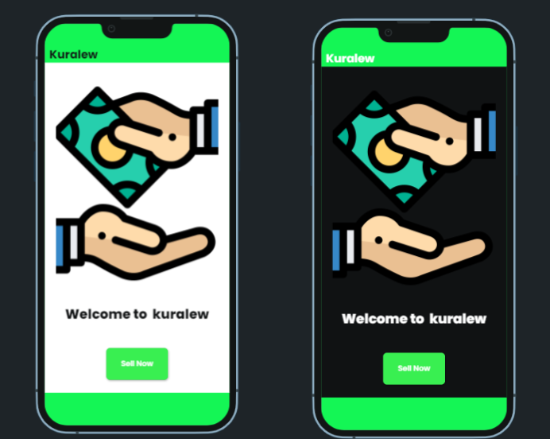

# Kuralew APP (ቁራሌው)



## Getting Started

This a an app that its mainpurpose isto help users sale items through their mobile phone that is old and used. It works in a way that the app estimates the cost of the product and it gives instant cash for the user and the user will ship it to the closest store.

## How to Use 

**Step 1:**

Download or clone this repo by using the link below:

```
https://github.com/kaleab-kali/kuralew.git
```

**Step 2:**

Go to project root and execute the following command in console to get the required dependencies: 

```
flutter pub get 
```
```
